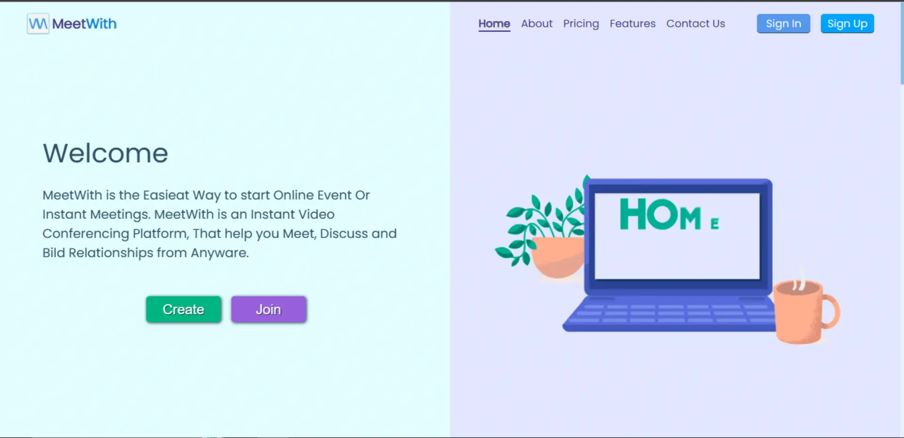

# Vide Conferencing solution




## Overview

This is a video calling application built for Integrating `STIRPE, JITSIMEET,REACTJS and EXPRESS WITH NODEJS`. You can use this app for Wibinar,Meeting and Calling.

### [Demo](https://meetwith.netlify.app)

## Requirements

1. [Node.js](https://nodejs.org/)
2. [npm](https://www.npmjs.com/)

## Setup Project

> Update `.env` PORT Variable With Dezired Port Number

Example

```env
PORT="4200"
```

## Steps to run this on your local

1. Clone this repo using `git clone https://github.com/rohittiwari-dev/meetwith`
2. Run `npm install` to install server dependencies
3. Run `npm start` to run the server
    > Production Build
4. Run `npm install` in the terminal
5. Run `npm run build` to Build Production Build of Project
6. Run `npm start` to start the Production Build.
7. Visit `localhost:4200`

## What's next 🚀

-   Better UI
-   More controls on the video/audio

## Tech stacks

-   React
-   Nodejs
-   SASS
-   Jitsi
-   Stripe

## Created & Maintained By

**Rohit Tiwari**


If you found this project helpful or you learned something from the source code and want thank me,

Nominate me for Github Star developer program
https://stars.github.com/nominate
